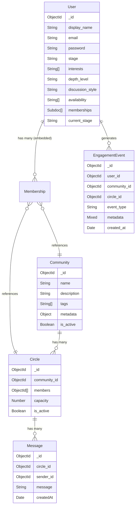

# SPARK Backend — System Context Report

> **Prepared by:** Principal Architect (Read-Only Audit)
> **Date:** 2026-06-10
> **Scope:** Every file under `src/`, `package.json`, project-level docs.
> **Mandate:** Understand, map, acknowledge. **Zero code changes.**

---

## 1. File Inventory & Dependency Map

### External Dependencies ([package.json](file:///c:/Users/MAHARSHI/Downloads/SPARK/package.json))

| Package | Version | Role |
|---|---|---|
| `express` | ^4.18.2 | HTTP framework |
| `mongoose` | ^7.0.0 | MongoDB ODM |
| `socket.io` | ^4.8.3 | Real-time WebSocket layer |
| `socket.io-client` | ^4.8.3 | Client lib (likely for testing; bundled in backend) |
| `bcrypt` | ^6.0.0 | Password hashing (native) |
| `bcryptjs` | ^3.0.3 | Password hashing (pure JS fallback — **redundant with bcrypt**) |
| `jsonwebtoken` | ^9.0.3 | JWT auth |
| `cors` | ^2.8.6 | Cross-origin middleware |
| `dotenv` | ^16.0.0 | Env variable loader |
| `nodemon` | ^3.1.14 | Dev-only auto-restart |

> [!NOTE]
> The project uses ES Modules (`"type": "module"`) throughout. All imports are ESM-style.

### Source Tree

```
src/
├── index.js                         ← Server entry, route mounting, Socket init
├── config/
│   ├── db.js                        ← MongoDB connection (with SRV DNS fallback)
│   └── progressionRules.js          ← Stage transition thresholds
├── middleware/
│   ├── auth.js                      ← Primary `protect` middleware (used by all routes)
│   ├── authMiddleware.js            ← Legacy `authMiddleware` (re-exported as `auth` from auth.js)
│   └── socketAuth.js                ← Socket.io JWT handshake middleware
├── models/
│   ├── userModel.js                 ← User schema (with embedded memberships subdocument)
│   ├── communityModel.js            ← Community schema (topic-level entity)
│   ├── circleModel.js               ← Circle schema (small-group chat cohort)
│   ├── messageModel.js              ← Chat message schema
│   └── engagementEventModel.js      ← Analytics event log schema
├── controllers/
│   ├── authController.js            ← Register / Login
│   ├── userController.js            ← Profile CRUD, progress endpoint
│   ├── communityController.js       ← List, join, leave communities (+ circle assignment)
│   ├── messageController.js         ← REST fetch of circle messages
│   ├── engagementController.js      ← Query engagement events
│   └── recommendationController.js  ← Community recommendations
├── services/
│   ├── circleMatchingService.js     ← ⚠️ THE MATCHING ENGINE (critical path)
│   ├── recommendationService.js     ← Community scoring/ranking
│   ├── engagementService.js         ← Fire-and-forget event logger
│   └── progressionService.js        ← Stage progression calculator
├── routes/
│   ├── authRoutes.js
│   ├── userRoutes.js
│   ├── communityRoutes.js
│   ├── circleRoutes.js
│   ├── engagementRoutes.js
│   └── recommendationRoutes.js
└── socket/
    ├── index.js                     ← Socket.io event handlers (chat, typing, join/leave)
    └── activeSockets.js             ← In-memory userId ↔ socketId registry
```

---

## 2. Data Model Topology

### Current State: Community → Circle (Hierarchical, Multi-Membership)



> [!IMPORTANT]
> **Correction to the original briefing:** The codebase does **NOT** currently use a flat, single-membership Group model. A prior refactor has already been executed. The legacy `groupModel.js` and `groupController.js` have been **deleted**. The `group_id` field has been **removed** from the User schema. The current architecture already implements the hierarchical **Community → Circle** paradigm with a **multi-membership** `memberships[]` embedded subdocument on User.
>
> The `implementation_plan.md` at the project root is a **historical artifact** describing this already-completed migration. It references files (`groupModel.js`, `groupController.js`, `groupRoutes.js`) that no longer exist in the codebase.

### Membership Model Details

User memberships are stored as an **embedded subdocument array** on the User document:

```javascript
memberships: [
  {
    community_id: ObjectId (ref: 'Community'),  // required
    circle_id: ObjectId (ref: 'Circle'),         // required
    joined_at: Date
  }
]
```

This means:
- A user can belong to **multiple communities** simultaneously.
- Each community membership is paired with exactly **one circle** within that community.
- Membership data is **denormalized** onto the User document (source of truth for "which communities is this user in?").
- The Circle document's `members[]` array is the **other side** of this relationship (source of truth for "who is in this circle?").

> [!WARNING]
> **Dual-write risk:** Both `User.memberships[]` and `Circle.members[]` must be kept in sync. The `joinCommunity` and `leaveCommunity` controllers use Mongoose transactions (`session.startTransaction()`) to handle this atomically — but the comment in the code acknowledges this **requires a MongoDB replica set**, which may not be available in all environments.

---

## 3. The Solid Foundation (What NOT to Break)

### ✅ JWT Authentication Pipeline — Verified Sound

The authentication system is clean, consistent, and well-layered:

| Layer | File | Mechanism |
|---|---|---|
| Token creation | [authController.js](file:///c:/Users/MAHARSHI/Downloads/SPARK/src/controllers/authController.js#L5-L7) | `jwt.sign({ userId }, JWT_SECRET, { expiresIn: '7d' })` |
| REST protection | [auth.js](file:///c:/Users/MAHARSHI/Downloads/SPARK/src/middleware/auth.js#L4-L29) | `protect` — extracts Bearer token, verifies, attaches `req.user = { id, userId }` |
| Legacy compat | [authMiddleware.js](file:///c:/Users/MAHARSHI/Downloads/SPARK/src/middleware/authMiddleware.js) | `authMiddleware` — identical logic, re-exported as `auth` |
| Socket protection | [socketAuth.js](file:///c:/Users/MAHARSHI/Downloads/SPARK/src/middleware/socketAuth.js) | Extracts token from `handshake.headers.authorization` OR `handshake.auth.token`, verifies, sets `socket.data.userId` |

**Observations:**
- Token payload uses `{ userId }` consistently at creation. Verification gracefully handles both `decoded.userId` and `decoded.id`.
- Password is hashed via `bcrypt` with salt rounds of 10. The User model's `pre('save')` hook has a **double-hashing guard** (line 77 of userModel.js: skips hashing if the value already looks like a bcrypt hash starting with `$2`).
- Password field is `select: false` by default, correctly requiring explicit `.select('+password')` in the login flow.
- No cookies are used anywhere. Auth is purely header-based.

**Verdict:** This entire auth pipeline is stable and should be preserved as-is.

---

### ✅ User Profile Schema — Verified Sound

The "curiosity fingerprint" data model on User is well-structured:

- **`interests[]`**: Free-form string array (used as the primary signal for matching and recommendations).
- **`depth_level`**: Enum `['surface', 'intermediate', 'deep']` — gates conversation intensity preference.
- **`discussion_style`**: Enum `['debate', 'explore', 'learn']` — gates interaction mode preference.
- **`availability[]`**: Free-form string array (not currently used in matching, but modeled).
- **`stage`**: Legacy field (default `'seeker'`) — appears to be a remnant; `current_stage` is the active progression field.

Profile updates are properly whitelisted to only `interests`, `depth_level`, `discussion_style`, `availability`.

**Verdict:** The user profile schema is solid. The `stage` vs `current_stage` duplication should be addressed eventually, but is not a blocker.

---

### ✅ Socket.io Real-Time Layer — Verified Sound

The [socket handler](file:///c:/Users/MAHARSHI/Downloads/SPARK/src/socket/index.js) is well-implemented:

- JWT-authenticated via `socketAuth` middleware on `io.use()`.
- Room-per-circle convention: `circle_<circleId>`.
- Events: `join_circle`, `leave_circle`, `typing_start`, `typing_stop`, `send_message`.
- Messages are persisted to MongoDB before broadcast.
- Acknowledgment callbacks are properly guarded with `typeof ack === 'function'`.
- Engagement events (`session_start`, `session_end`, `message_sent`) are logged fire-and-forget.
- [Active socket registry](file:///c:/Users/MAHARSHI/Downloads/SPARK/src/socket/activeSockets.js) maintains a bidirectional `userId ↔ socketId` map in memory.

**Verdict:** This layer is clean. It correctly couples to Circles (not Communities), which is the right abstraction for chat rooms.

---

### ✅ Engagement & Progression System — Verified Sound

- [engagementService.js](file:///c:/Users/MAHARSHI/Downloads/SPARK/src/services/engagementService.js): Fire-and-forget `logEvent()` that silently catches errors. Used by socket handlers.
- [engagementEventModel.js](file:///c:/Users/MAHARSHI/Downloads/SPARK/src/models/engagementEventModel.js): Properly indexed on `user_id`, `community_id`, `circle_id`, `event_type`, `created_at`.
- [progressionService.js](file:///c:/Users/MAHARSHI/Downloads/SPARK/src/services/progressionService.js): Calculates progression based on `message_sent` count and `session_start` count against thresholds in [progressionRules.js](file:///c:/Users/MAHARSHI/Downloads/SPARK/src/config/progressionRules.js).
- The progression endpoint (`GET /api/users/progress`) is properly protected.

> [!NOTE]
> **Gap:** The progression system calculates eligibility but **never actually promotes** the user. `checkPromotionEligibility()` exists but is never called from any controller or socket handler. The `current_stage` field on User is never updated after initial creation. This is a known feature gap, not a bug.

**Verdict:** Solid foundation. The auto-promotion trigger is a future feature.

---

## 4. The Performance Risk: Circle Matching Algorithm — O(N × M × Q)

### Location: [circleMatchingService.js](file:///c:/Users/MAHARSHI/Downloads/SPARK/src/services/circleMatchingService.js)

This is the **critical hot path** — it runs on every `POST /api/communities/:id/join` request.

### How It Works

```
findBestCircleForUser(user, communityId, session)
│
├── 1. Fetch ALL active circles in this community with capacity
│      Circle.find({ community_id, is_active, $expr: members < capacity })
│      .populate('members')                    ← N circles, each with up to 8 User docs
│
├── 2. For EACH candidate circle (N):
│   ├── For EACH member in circle (up to M=8):
│   │   └── calculatePairwiseCompatibility(newUser, member)
│   │       ├── Shared interests scan: O(I × J) where I,J = interest array lengths
│   │       ├── depth_level match: O(1)
│   │       └── discussion_style match: O(1)
│   │
│   └── 3. Activity query: Message.countDocuments({ circle_id, createdAt >= 7d ago })
│          ← This is a DB query PER circle (Q queries total)
│
├── 4. Weighted scoring: 60% compatibility + 25% occupancy + 15% activity
└── 5. Sort and return top scorer
```

### Complexity Analysis

| Variable | Meaning | Current Bound | At Scale |
|---|---|---|---|
| N | Circles with capacity in this community | Small (few) | Could be 100s-1000s |
| M | Members per circle | Capped at 8 | Always ≤ 8 |
| I×J | Interest comparison per pair | ~5×5 = 25 | Depends on user profiles |
| Q | Message count queries | = N (one per circle) | 100s-1000s of DB queries |

**The true bottleneck is not the O(N×M) pairwise computation (M is capped at 8). It's the N separate `Message.countDocuments()` queries inside the loop.**

> [!CAUTION]
> **At scale with a popular community (e.g., 500+ circles with capacity), a single join request will:**
> 1. Load and `.populate()` all 500 circles with their member documents — a massive MongoDB query with potentially 4000 embedded user docs.
> 2. Execute **500 separate `countDocuments` queries** against the messages collection to compute activity scores.
> 3. All of this runs **synchronously within the HTTP request handler**, blocking the event loop for potentially seconds.
>
> This is not O(N²) in the traditional sense, but it's **O(N) DB queries + O(N×M) in-memory computation**, which is equally devastating at scale. A single popular community with many open circles will cause timeouts and memory pressure.

### Scoring Weights

```
finalScore = (compatibility × 0.60) + (occupancy × 0.25) + (activity × 0.15)
```

- **Compatibility (60%)**: Average of pairwise scores between the joining user and each existing member. Max 100 per pair (60 for interests, 20 for depth, 20 for style).
- **Occupancy (25%)**: `(members.length / capacity) × 100` — biases toward fuller circles (promotes dense groups).
- **Activity (15%)**: Message count in last 7 days, normalized (50 messages = 100 score).

---

## 5. Community Recommendation Engine

### Location: [recommendationService.js](file:///c:/Users/MAHARSHI/Downloads/SPARK/src/services/recommendationService.js)

This is a simpler system. It runs on `GET /api/recommendations`:

1. Fetches **all active communities** from the DB.
2. Filters out communities the user has already joined.
3. Scores each remaining community against the user's fingerprint:
   - **Interest matching (max 60)**: Substring search of each user interest against community `name`, `description`, and `tags[]`. 30 points per match, capped at 60.
   - **Depth matching (max 20)**: Exact match of `user.depth_level` vs `community.metadata.depth_level`.
   - **Style matching (max 20)**: Exact match of `user.discussion_style` vs `community.metadata.discussion_style`.
4. Sorts descending by score.

> [!NOTE]
> This has a similar scaling concern (loads all communities into memory), but the data volume is much smaller (communities are system-managed, likely < 100). Low risk at current scale.

---

## 6. Transactional Integrity

The [communityController.js](file:///c:/Users/MAHARSHI/Downloads/SPARK/src/controllers/communityController.js) uses **Mongoose transactions** for both join and leave operations:

```javascript
const session = await mongoose.startSession();
session.startTransaction();
// ... operations ...
await session.commitTransaction();
```

This ensures that the dual-write to `User.memberships[]` and `Circle.members[]` is atomic. However, the code includes a comment acknowledging that **transactions require a replica set**, and a single-node MongoDB (common in dev) will throw an error.

---

## 7. Identified Gaps & Risks (Summary)

| # | Category | Issue | Severity |
|---|---|---|---|
| 1 | **Performance** | Circle matching does N DB queries + N×M pairwise computation on every join | 🔴 High |
| 2 | **Performance** | `.populate('members')` on all candidate circles loads potentially thousands of User documents | 🔴 High |
| 3 | **Feature Gap** | Auto-promotion never fires — `checkPromotionEligibility()` is orphaned | 🟡 Medium |
| 4 | **Schema Debt** | `stage` (legacy) and `current_stage` (active) coexist redundantly on User | 🟡 Medium |
| 5 | **Dependency Debt** | Both `bcrypt` (native) and `bcryptjs` (pure JS) are installed — only `bcrypt` is used | 🟢 Low |
| 6 | **Security** | `GET /api/users` and `POST /api/users` are **unprotected** (no `protect` middleware) | 🟡 Medium |
| 7 | **Security** | Debug `console.log` statements in auth middleware and login controller leak header info | 🟢 Low |
| 8 | **Missing Routes** | No `GET /api/communities/:id`, no circle member list endpoint, no admin CRUD | 🟡 Medium |
| 9 | **Stale Doc** | `implementation_plan.md` at root references deleted files (`groupModel`, `groupController`) | 🟢 Low |
| 10 | **Transactions** | Join/leave operations require replica set, which may not exist in dev environments | 🟡 Medium |

---

## 8. What I Did Not Find

- No test files (no `tests/`, `__tests__/`, `*.test.js`, or `*.spec.js` anywhere).
- No rate limiting middleware.
- No input validation/sanitization library (no `joi`, `zod`, `express-validator`).
- No logging framework (only `console.log` / `console.error`).
- No error handling middleware (errors caught per-controller, no centralized handler).
- No health-check beyond the root `GET /` returning a string.

---

## Final Question

The codebase is in a **partially-evolved state**. The Community → Circle migration has already been executed — the hierarchical, multi-membership model is live and functional. The old Group model is gone.

The remaining systemic issues are:

1. **The matching engine's scaling problem** (O(N) DB queries per join request).
2. **Feature completeness gaps** (orphaned promotion logic, missing API routes, unprotected endpoints).
3. **Operational maturity gaps** (no tests, no validation, no logging, no rate limiting).

**How would you like to approach the next phase of work?** For example:

- **Option A: Performance First** — Rewrite `circleMatchingService.js` to eliminate the N-query pattern (e.g., pre-computed activity scores, batch population, or index-driven scoring).
- **Option B: Feature Completeness** — Wire up the orphaned promotion system, add missing CRUD routes, lock down unprotected endpoints.
- **Option C: Operational Hardening** — Add input validation, centralized error handling, structured logging, and a test suite before touching any logic.
- **Option D: Full Architectural Review** — Step back and evaluate whether the current embedded-subdocument membership model, the current matching weights, and the overall data topology are the right long-term choices before building more on top.
- **Option E: Your own priority order** — Tell me what matters most right now.
